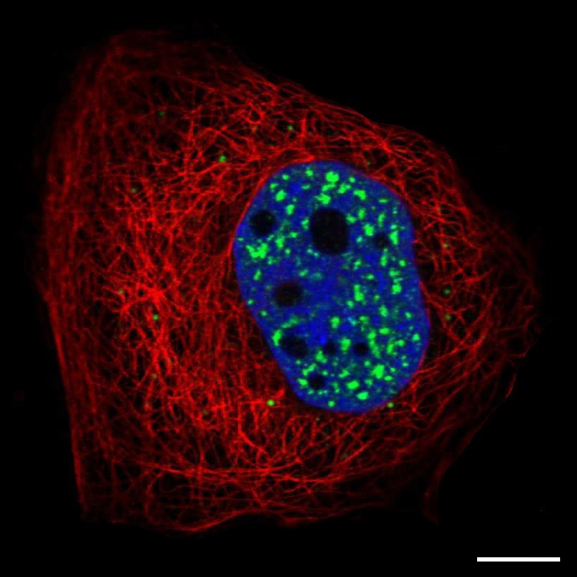
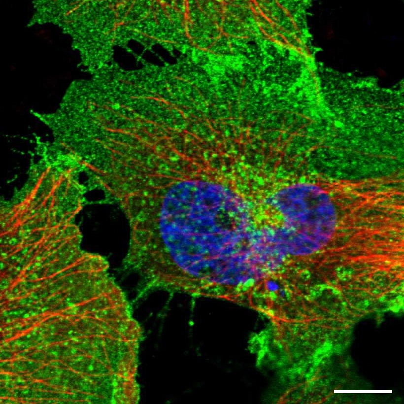
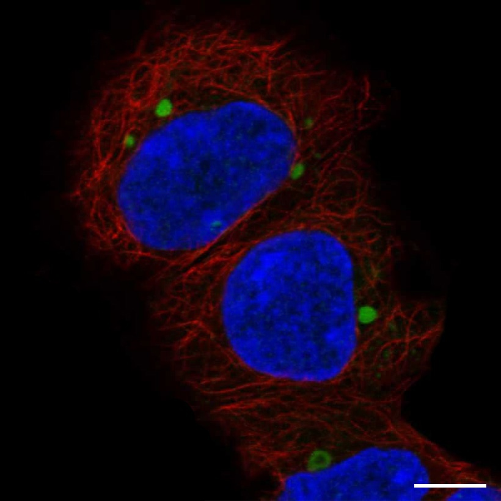
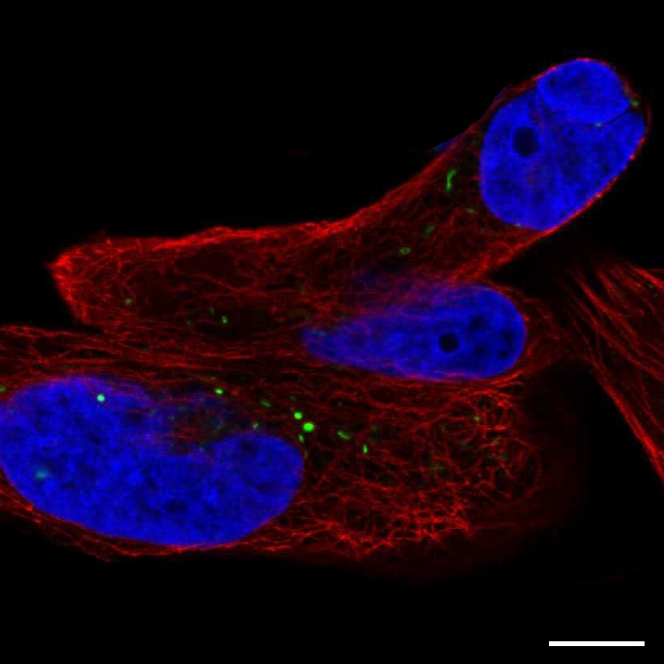

参考网站：https://www.proteinatlas.org/learn/dictionary/cell

# 待分类蛋白质图片示例

## 0 Nucleoplasm 核质

    

## 1 Nuclear membrane 核膜

    

## 2 Nucleoli 核仁

    
   

## 3 Nucleoli fibrillar center 核仁纤维中心

   

## 4 Nuclear speckles 核散斑

   

## 5 Nuclear bodies 核点

    

## 6 Endoplasmic reticulum 内质网

    

## 7 Golgi apparatus 高尔基体

    

## 8 Peroxisomes 过氧化物酶体

   

## 9 Endosomes 内体

   

## 10 Lysosomes 溶酶体

   

## 11 Intermediate filaments 中间丝

    

## 12 Actin filaments 微丝/肌动蛋白丝

    
   

## 13 Focal adhesion sites 黏着斑

    

## 14 Microtubules 微管

    
   

## 15 Microtubule ends 微管末端

  

## 16 Cytokinetic bridge 细胞动力学桥（？）

   

## 17 Mitotic spindle 纺锤体

   

## 18 Microtubule organizing center 微管组织中心

   

## 19 Centrosome 中心体

    
   

## 20 Lipid droplets 脂滴

    

## 21 Plasma membrane 质膜

    
    

## 22 Cell junctions 细胞连接

    
   

## 23 Mitochondria 线粒体

    
    

## 24 Aggresome 聚集小体

   

## 25 Cytosol 细胞质基质

    
   

## 26 Cytoplasmic bodies 细胞质小体（？）

    

## 27 Rods & rings 棒环（？）

   

