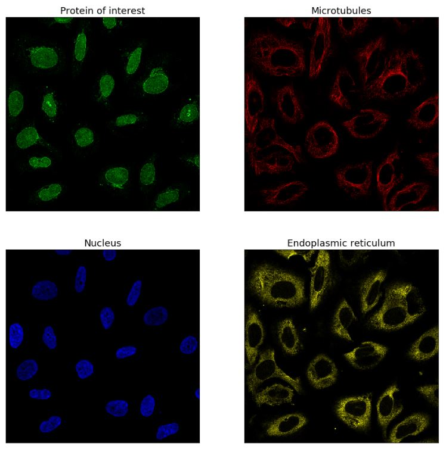
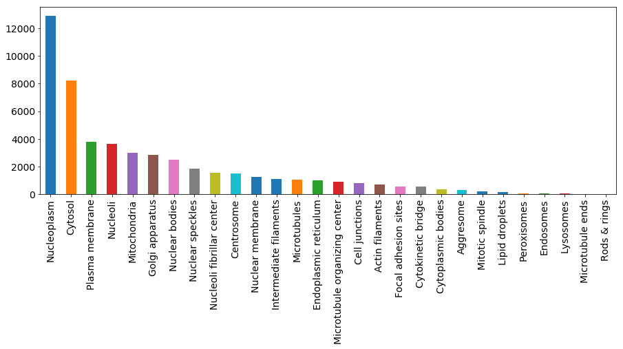

# protein

## code
<https://www.kaggle.com/rejpalcz/cnn-128x128x4-keras-from-scratch-lb-0-328>

## information

images by [Jonathan Schnabel](https://www.kaggle.com/jschnab/exploring-the-human-protein-atlas-images)

green: protein  
red: microtubules  
blue: nucleus  
yellow: endoplasmic reticulum  

0  Nucleoplasm  
1  Nuclear membrane  
2  Nucleoli  
3  Nucleoli fibrillar center  
4  Nuclear speckles  
5  Nuclear bodies  
6  Endoplasmic reticulum  
7  Golgi apparatus  
8  Peroxisomes  
9  Endosomes  
10  Lysosomes  
11  Intermediate filaments  
12  Actin filaments  
13  Focal adhesion sites  
14  Microtubules  
15  Microtubule ends  
16  Cytokinetic bridge  
17  Mitotic spindle  
18  Microtubule organizing center  
19  Centrosome  
20  Lipid droplets  
21  Plasma membrane  
22  Cell junctions  
23  Mitochondria  
24  Aggresome  
25  Cytosol  
26  Cytoplasmic bodies   
27  Rods & rings  
