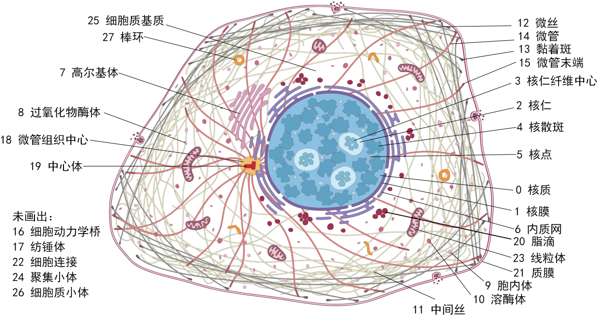

参考网站：https://www.proteinatlas.org/learn/dictionary/cell

# 四个通道

绿色：待分类蛋白质

红色：微管（同蛋白质14）

蓝色：细胞核

黄色：内质网（同蛋白质6）

# 待分类蛋白质介绍

## 0 Nucleoplasm 核质

细胞核是人类细胞最大的细胞器，几乎包含所有DNA（其余在线粒体中）。DNA缠绕在称为组蛋白的蛋白质复合物上，形成致密的染色质。细胞核中有核质，是一种半流体，里面有酶、转录因子、核苷酸等分子，被核膜包围，与细胞其他部分分开。这保证了DNA复制和转录可以高度可控，不被其他物质干扰。

**和细胞核（blue channel）共定位（意思指它们的位置完全重叠）**

## 1 Nuclear membrane 核膜

核膜是包围细胞核的脂双层，使细胞核与细胞质分开。这确保两个部分的分子反应不受干扰和基因表达高度可控。外膜与内质网相连，内膜是染色质的锚点。内外膜之间的部分称为核周腔。核孔复合物分布在整个膜上，实现大分子物质在细胞核和细胞质之间的交换。

核膜很容易辨认，是围绕细胞核的薄层。但是细胞膜不一定非常光滑，因为它也可能在细胞核内形成小的圆点，容易被误认为是核点。

**同样，和细胞核（blue channel）共定位，它的特点是细胞核周围一圈荧光强度很高，圈内的荧光强度相对较低，在细胞核外有强度更低的弥散荧光**

## 2 Nucleoli 核仁

核仁是细胞核内的无膜结构，与核糖体的合成有关。它也与细胞的有丝分裂、应激反应、细胞周期调控有关。在结构上，核仁分为三个部分：纤维中心（FC）、致密纤维组分（DFC）、颗粒组分（GC）。

核仁一般是小的、略微拉长的圆形，位于细胞核内。其数量和形态取决于细胞类型。一些蛋白质位于核仁的边缘，可见围绕核仁的薄层。

**在细胞核（blue channel）内部，呈近圆形或不规则的几个圆形**

## 3 Nucleoli fibrillar center 核仁纤维中心

纤维中心是核仁的组成部分。是核糖体合成第一步骤的场所，rDNA转录为前体-rRNA，然后在DFC进一步修饰，最后在GC组装。

核仁纤维中心大多数是一些簇状斑点，但也有可能是单一较大的斑点。

**在细胞核（blue channel）内部的核仁（第2个待分类蛋白）内部，簇状的点**

## 4 Nuclear speckles 核散斑

散斑是细胞核内的无膜结构，里面有前体mRNA剪接因子。此外，核散斑也控制转录。

核散斑在核基质中呈不规则的斑点，不同细胞系的大小和性质可能不同。

**在blue channel内部，大片的斑点，边缘不是很清晰**

## 5 Nuclear bodies 核点

核点是一些无膜亚核结构的统称，包括：卡哈尔体(CB)、卡哈尔体双子（gems）、早幼粒细胞白血病蛋白体（PML）。CB与RNA剪接有关，PML与凋亡调控有关。

核点在核基质中呈点状分布。数量、大小因细胞系而异。

**blue channel内部的一些小点**

## 6 Endoplasmic reticulum 内质网

内质网是与核膜的外膜相连，在整个细胞中形成膜系统，包括光面内质网和粗面内质网两种。粗面内质网有核糖体附着，负责合成蛋白质并分泌。光面内质网与脂质的合成有关。此外，内质网也是细胞内离子储存的场所，对细胞稳态的维持和的吸收有重要作用。 

由于内质网与核膜相连，因此可以通过核膜和细胞质基质中的网状形态进行辨认。通常在细胞核附近染色较深，接近细胞边缘则较淡。

**围绕在细胞核（blue channel）外围，网状结构，荧光强度逐渐从细胞核膜向细胞外膜递减，荧光几乎覆盖整个细胞**

## 7 Golgi apparatus 高尔基体

高尔基体由许多囊泡堆叠而成，可以划分为顺面、中间和反面。高尔基体参与细胞内蛋白质的运输、其他细胞器膜的形成、物质分泌到细胞外。

高尔基体位于细胞核旁边，其形态随细胞系而不同。通常接近球形，被微管组织中心围绕，但也可能包裹整个细胞核。

**blue channel外的网状结构，边缘较清晰，不像内质网那样弥散，面积也不像内质网那么大**

## 囊泡结构
-------------------------------------------------------------
>*学生物的人表示，这个栏目中的东西很难单靠形态区分，意见仅供参考*

囊泡结构通常表现为细胞质基质中的小而量的斑点。脂滴一般是较完美的圆环。但其他囊泡的区分比较困难，但其数量、大小、分布都有不同：胞内体一般靠近细胞核和高尔基体，溶酶体一般靠近高尔基体，但更大，染色更深。过氧化物酶体在细胞内广泛分布，形态是拉长的椭圆。

### 8 Peroxisomes 过氧化物酶体

过氧化物酶体中有许多代谢的酶，分解脂肪酸是主要功能之一。过氧化物酶体也是过氧化氢分解的场所，例如乙醇的解毒。

**细胞质（可以大致由微管red channel来定位，以下同）中广泛分布的小点点**

### 9 Endosomes 内体

内体主要用于分拣通过胞吞从细胞外获取的物质。内体可以通过将物质送回细胞膜进行循环利用，也可以通过溶酶体将其分解。

**内体也是在细胞质中的小点，很难和过氧化物酶体区分，强行看图片来说的话，可能内体的有大有小，大小不如过氧化物酶体那样均匀**

### 10 Lysosomes 溶酶体

溶酶体内有许多氧化酶，主要用于分解细胞内的分子。溶酶体可以与次级内体结合，形成内溶酶体，可分解内体内部的物质。

**也是在细胞质中广泛分布的点，和过氧化物酶体相比，溶酶体更大一些，并且更亮一些；溶酶体一般更靠近高尔基体（但是估计这条规则没什么用）**

### 20 Lipid droplets 脂滴

脂滴是专门用来储存中性脂质的细胞器。其大小有差别，结构上有储存脂质的疏水核心，被镶嵌着蛋白质的脂单层包围。

**细胞核（blue channel）膜的周围分布比较多，形状是较为规则的圆形，比以上的几种囊泡结构都大，脂滴的边缘荧光强度较高，脂滴内部较低**

## 11 Intermediate filaments 中间丝

中间丝是最稳定的细胞骨架成分，它主要起支撑作用，在细胞中围绕着细胞核分布，成束成网，并扩展到细胞质膜，与质膜相连结。
中间丝是像绳子一样拧成的结构，可以支撑细胞。头发、皮肤等承受机械压力的细胞通常含有较多中间丝。此外，中间丝也参与染色质的组织，核纤层由中间丝构成，位于核膜内侧，可以将染色质与核纤层锚定。

不同细胞的中间丝可能差别很大。一般细胞核附近都会有中间丝，但是一些可能延伸到整个细胞。大多数图像中，中间丝都有轻微的缠绕。

## 12 Actin filaments 微丝/肌动蛋白丝

肌动蛋白丝是质膜附近聚集的微丝，可能是长束，也可能是小块。它们组成细胞骨架的一部分，形成质膜下方的保护层。微丝末端是黏着斑，将细胞与细胞外基质相连。它们一同控制细胞的运动和形态。微丝也可以作为细胞内囊泡运输的轨道，形成细胞动力学桥的中环。

微丝可能是纤维长束，也可能是纤维小块，位于质膜下方。

## 13 Focal adhesion sites 黏着斑

黏着斑是微丝的末端，用于将细胞与细胞外基质连接，也与细胞的运动有关。

黏着斑位于细胞膜外侧，可在细胞膜边缘找到。

## 微管与微管末端

微管表现为分布于整个细胞的纤维，几乎可以容易找到微管组织中心作为出发点。一些蛋白质大量聚集在微管的正端，因此远离微管组织中心的一端容易被染色。纺锤体可以在细胞分裂期看到，与染色体相连。纺锤体的形状大小与细胞及分裂时期有关。

### 14 Microtubules 微管

微管是细胞内囊泡运输的轨道。它们从微管组织中心出发，延伸到细胞边缘。微管的特征是他们在细胞内不断延长和收缩，不会形成稳定状态，这使得细胞可以根据环境条件改变形态。

### 15 Microtubule ends 微管末端

微管的快速变化在微管末端的正端体现非常明显，而负端与维管组织中心相连，因此变化较慢。

### 17 Mitotic spindle 纺锤体

在有丝分裂期，微观网络完全结题，形成纺锤体，将复制的染色体分配到两个子细胞中。

## 16 Cytokinetic bridge 细胞动力学桥（？）

细胞动力学桥是在细胞分裂的最后阶段（胞质分裂）出现的结构。 它由从收缩环突出的微管蛋白丝组成。 细胞凋亡桥的宽度和长度取决于胞质分裂的进展，随进展时不断缩小。 在胞质分裂的最后阶段，桥被切割并且细胞被分离。

细胞动力学桥的最主要特征是两个即将分离细胞的微管纤维。

## 微管组织中心与中心体

维管组织中心与中心体难以界定，因为它们与细胞质基质没有清晰的边界，中心粒周围物质也随细胞周期而异。在G1期，中心体位于微观中心，靠近核膜。能与两个中心粒或微管起点很小区域特异性结合的抗体称为中心体，而较大模糊的区域则称为微管组织中心。微管组织中心在细胞系之间、细胞之间都有差异。

### 18 Microtubule organizing center 微管组织中心

微管组织中心将微管蛋白组装成微管，将其组织起来，对细胞的极性非常重要。中心体、基体、纺锤机体都是微管组织中心的不同形态。

### 19 Centrosome 中心体

中心体是人类细胞的主要微观组织中心，由两个中心粒组成，被中心粒旁基质包围。中心体使中心粒旁基质聚集，进一步合成微管。在细胞分裂前，两个中心粒分离复制，形成两个完整的中心体，分布在细胞两极，作为纺锤体的起点。

## 21 Plasma membrane 质膜

细胞膜是包围细胞的脂双层，将细胞与外界隔开。可以通过被动或主动运输实现分子选择性运输。此外，细胞膜也参与许多信号转导。

细胞膜的呈像结果可能很不同。有时是包围细胞的一个清晰的边界，而有时细胞膜外的膜突起非常明显。还有时荧光均一平铺在整个细胞，因此有时细胞膜和细胞质的荧光呈像结果难以区分。

## 22 Cell junctions 细胞连接

细胞连接位于两个相邻细胞之间或细胞与细胞外基质之间。细胞连接是细胞间通讯的重要信号通道。此外，细胞连接也与细胞之间物质传递的通道有关。

只有相邻细胞接触时，才能看到细胞连接。这种荧光非常特别，仅在细胞与细胞连接处可见。

## 23 Mitochondria 线粒体

线粒体在细胞中产生能量，也与细胞周期调控等其他功能相关。线粒体分布在整个细胞质，由两层膜包被。内膜向内折叠成嵴，是细胞器内反应的主要场所。与其他细胞器不同，线粒体有自己的DNA，包含37个基因。

线粒体的荧光标记容易辨认，呈长的线状。它们分布在整个细胞质，从细胞核出发一直延伸到细胞边缘。一些细胞的线粒体可能是较短、相互分离的线状。

## 24 Aggresome 聚集小体

聚集小体是细胞质中错误折叠的蛋白质的聚集，通常在应激环境下错误折叠的蛋白质较多时出现。聚集小体的形成对于防止错误折叠的蛋白质影响细胞质功能具有重要作用。

聚集小体一般在细胞核周围形成，在细胞质基质中呈大泡泡形状。聚集小体的形成通常会打断微管网络，所以容易辨认。聚集小体的荧光标记在不同细胞系中非常不同。

## 25 Cytosol 细胞质基质

细胞质基质填充质膜与细胞核之间的部分，容纳细胞器和细胞结构。细胞质基质占70%的细胞体积，对细胞代谢和蛋白质生物合成具有重要作用。

细胞质基质的荧光标记分布除细胞核外的整个细胞。染色可能是平滑的，也可能是颗粒状的，通常在细胞核附近较深。

## 26 Cytoplasmic bodies 细胞质小体（？）

细胞质小体是细胞质内不同结构的统称，例如处理小体和应激颗粒等。 细胞质小体的特征性很不清楚，但已知在mRNA转换中具有重要任务，包括mRNA衰变或沉默。

细胞质小体容易与囊泡混淆。但是通过大小和数量可以区分。细胞质小体相对较大，数量较少。

## 27 Rods & rings 棒环（？）

Rods and Rings是一种表征不佳的细胞质结构，在人类细胞中以低水平存在，功能还有待揭示。

Rods and Rings是以其形态命名，但其大小和数量相差很大。
